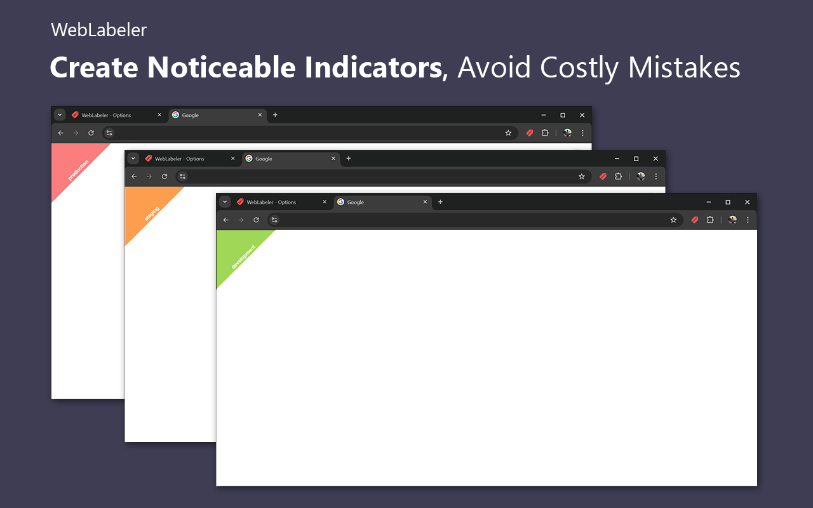
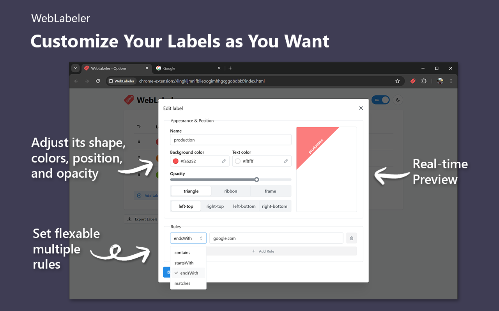
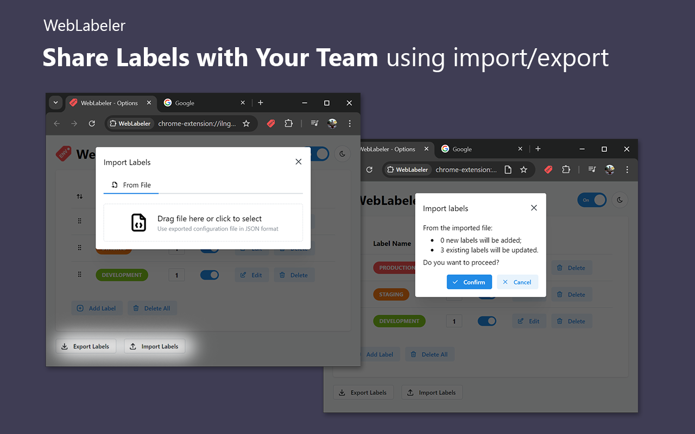
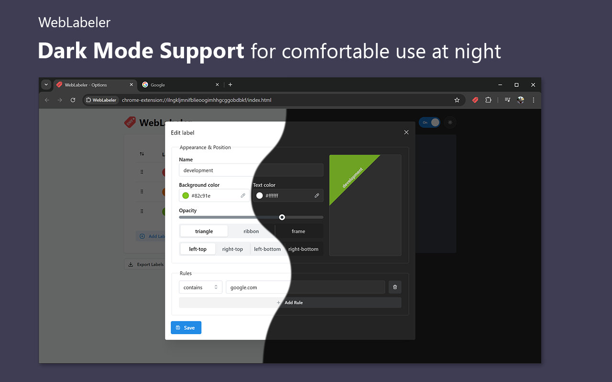
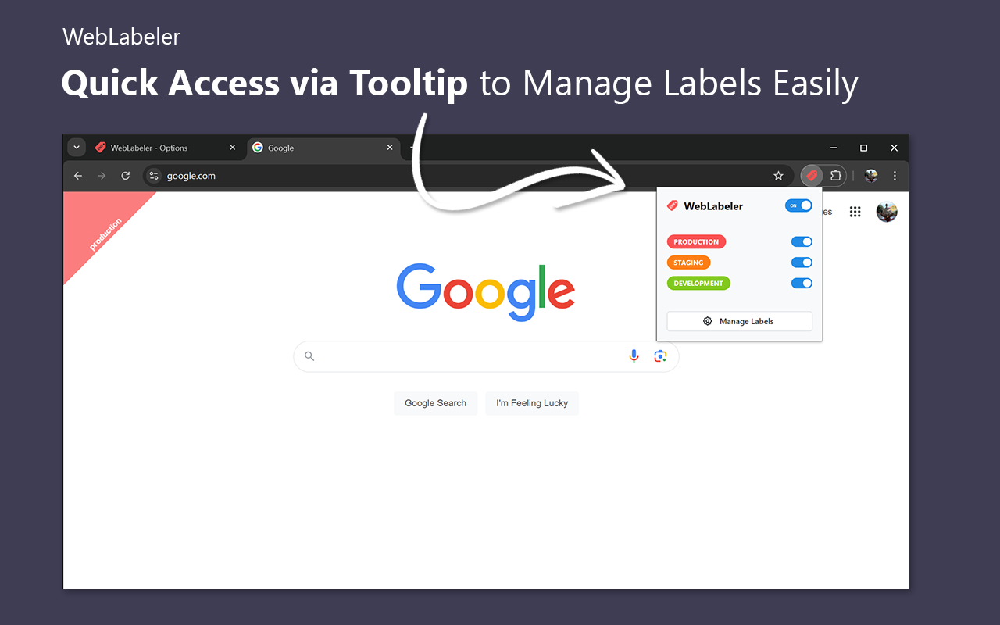

## About

**WebLabeler** is a handy web browser extension for web developers, testers, content managers, and others juggling
multiple environments (development, testing, staging, and production) daily. With this lightweight extension, you can
effortlessly create noticeable indicators that make your tabs easily distinguishable, helping you avoid mix-ups and
costly mistakes. Boost your productivity and stay organized with WebLabeler! 💪✨

## Installation

You can install WebLabeler directly from the Chrome Web Store or Firefox Add-ons (AMO) by clicking the link below:

## Key Features:

- **Fully Customizable Labels** 🎨 Design your labels exactly how you want by adjusting their shapes (triangle, ribbon,
  or frame), colors, positions, and opacity.
- **Favicon Badging** 🔖 Instantly distinguish projects directly in the browser tab bar.
- **Powerful Domain Rules** 🌐 Automatically apply labels to your projects based on their domain names using flexible
  rule types.
- **Quick Access via Popup** 🖱 Easily toggle labels on or off without navigating to the settings.
- **Export/Import Configurations** 📦 Share label settings with your team or reuse them across projects. Supports URL
  sync with automatic updates.
- **Easy Migration** 📥 Migrate your data from other extensions and start using WebLabeler right away.
- **Sync Across Devices** 🔄 Keep your label configurations synchronized across all your devices
  account sync feature.
- **Dark Mode Support** 🌙 Enjoy a dark mode option for comfortable use during late-night sessions or in low-light
  environments.

## Preview:

